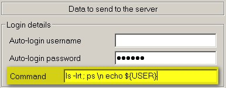

<iframe src="gad.html" frameborder="0" scrolling="no" style="border: 1px solid gray; padding: 0; overflow:hidden; scrolling: no; top:0; left: 0; width: 100%;" onload="this.style.height=(this.contentWindow.document.body.scrollHeight+5)+'px';"></iframe>

## Automatic command

With **KiTTY** it is possible to send an automatic command as soon as the connection to the server (telnet or ssh) is up. 
You just have to fill the **Command** field in the **Connection/Data** configuration box.

As for the [Password](AutomaticPassword.md) field you can send several commands. 
Commands have to be separated by the two characters **\n** (see example above). 

Some special characters have been created:

* **\p** means wait for 1 second (you can add several **\p** if needed )
* **\s05** for a 5 second pause (05 or another value )
* **\\** of course for sending a **\**
 
Some delays can be configured in the **kitty.ini** file for autocommand feature:

    [KiTTY]
    initdelay=2.0
    commanddelay=0.1
    bcdelay=5

* initdelay: this is the delay (in seconds) between KiTTY startup and the sending of the first autocommand line
* commanddelay: this is the delay (in seconds) between two lines (the same between login and password, and password and command)
* bcdelay: this is the delay (in milliseconds) between characters (should not be modified) 
 
