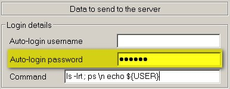

<iframe src="gad.html" frameborder="0" scrolling="no" style="border: 1px solid gray; padding: 0; overflow:hidden; scrolling: no; top:0; left: 0; width: 100%;" onload="this.style.height=(this.contentWindow.document.body.scrollHeight+5)+'px';"></iframe>

## Automatic password

With **KiTTY** you can make automatic connection to telnet, ssh-1 and ssh-2 servers. Just fill the **Auto-login password** field in the **Connection/Data** configuration box.

Of course the password value is encrypted ! Since this value is different for each different host, it is not possible to save a password in a session with an empty hostname.

### About SSH
In the case of ssh servers, the password is transferred during the authentication process.

### About Telnet
In the case of telnet servers, the contents of this field are sent just after the connection is up, exactly as if you are typing it on your keyboard. 
It is even possible to send several lines to the server (for example: a login name, followed by a password, followed by a command). 
These lines should be separated by the two characters **\n**. 
However, since version 0.60.65.32 there is a more efficient method to connect to telnet servers: [the logon script method](LogonScript.md).
