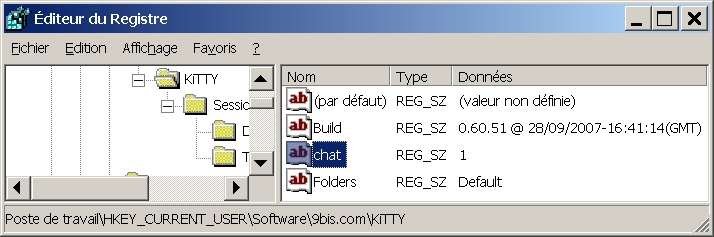
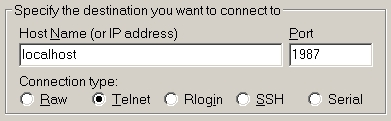

<iframe src="gad.html" frameborder="0" scrolling="no" style="border: 1px solid gray; padding: 0; overflow:hidden; scrolling: no; top:0; left: 0; width: 100%;" onload="this.style.height=(this.contentWindow.document.body.scrollHeight+5)+'px';"></iframe>

## Chat

A light command-line chat server is hidden in **KiTTY**. To activate it open your registry editor to **[HKEY_CURRENT_USER\Software\9bis.com\KiTTY]** key, and create a new **REG_SZ** type value called `chat` and containing `1`.

Then put that [library](../files/kchat.dll) just near your **kitty.exe** file.

When launching the first KiTTY session, the chat server will automatically start. To connect the server and begin a chat session, create a **passive** telnet session at **localhost:1987** (**1987** is the port number). Of course you can start your chat session in the same KiTTY where you create the server (i.e. the first KiTTY window).

As it's not easy to have keyboard input and screen output on the same window, you can start a new dedicated input-box by pressing the **CTRL+F8** keys.
 
