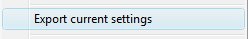

<iframe src="gad.html" frameborder="0" scrolling="no" style="border: 1px solid gray; padding: 0; overflow:hidden; scrolling: no; top:0; left: 0; width: 100%;" onload="this.style.height=(this.contentWindow.document.body.scrollHeight+5)+'px';"></iframe>

## File association

There is a new menu option, to export the settings of the running session into a plain text file. Search for the item **Export current settings** in the main menu: 

The default extension for these files is **.ktx**.

Then it is possible to run directly this saved session with a double-click on the **.ktx** file. But first you need to associate **.ktx** file with **KiTTY**: `kitty.exe -fileassoc`

Here are two examples of save session you can run directly from KiTTY:

| Star wars in telnet mode | Chat in telnet mode |
|------------------------|-------------------|
|||
