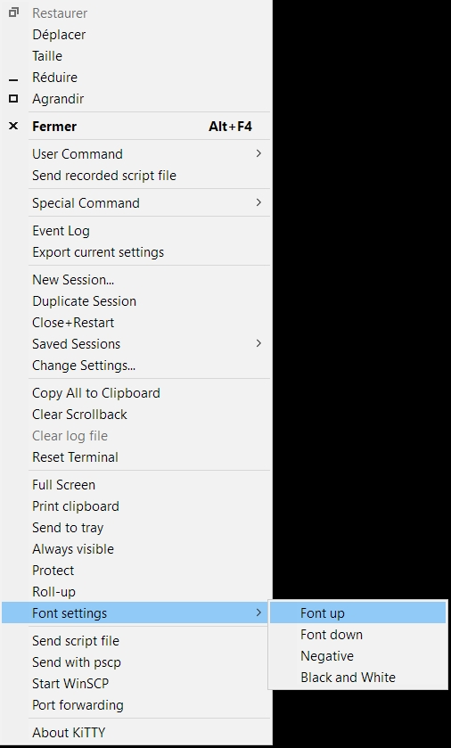

<iframe src="gad.html" frameborder="0" scrolling="no" style="border: 1px solid gray; padding: 0; overflow:hidden; scrolling: no; top:0; left: 0; width: 100%;" onload="this.style.height=(this.contentWindow.document.body.scrollHeight+5)+'px';"></iframe>

## Font managment

A **Font settings** option is available in the main menu. It is used:

* to increase/decrease font size
* to switch to negative colors
* to switch between black on white or white on black terminal

Size managment can be done by pressing **CTRL+wheel mouse** too.
