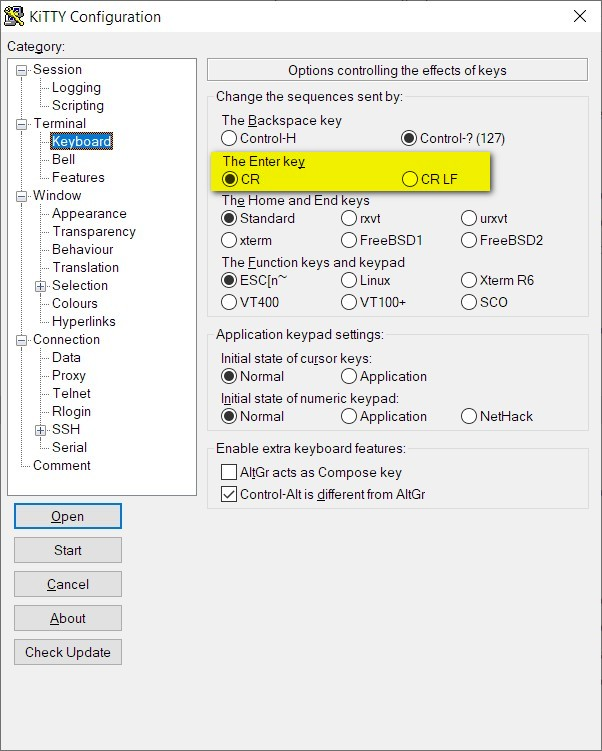

<iframe src="gad.html" frameborder="0" scrolling="no" style="border: 1px solid gray; padding: 0; overflow:hidden; scrolling: no; top:0; left: 0; width: 100%;" onload="this.style.height=(this.contentWindow.document.body.scrollHeight+5)+'px';"></iframe>

## Force CR/LF on Enter key

In some situation it can be useful to force **CR/LF** on **Enter** key (default if **LF** only).

Just set it in **Terminal/Keyboard** tab of the configuration box:

