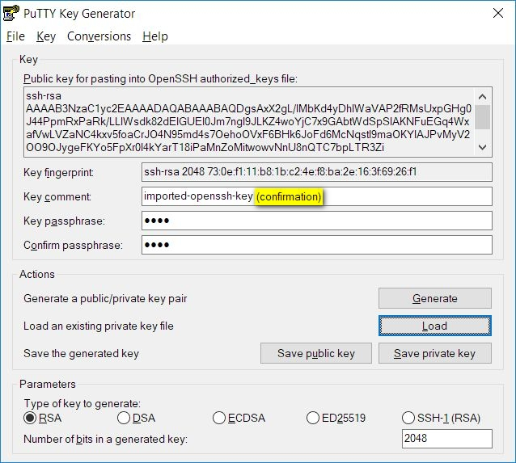
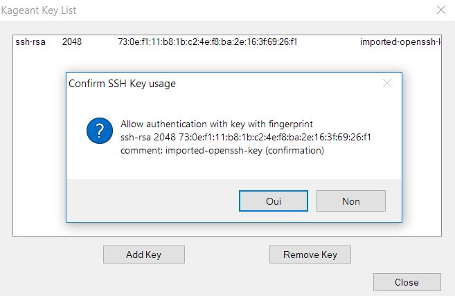

<iframe src="gad.html" frameborder="0" scrolling="no" style="border: 1px solid gray; padding: 0; overflow:hidden; scrolling: no; top:0; left: 0; width: 100%;" onload="this.style.height=(this.contentWindow.document.body.scrollHeight+5)+'px';"></iframe>

## Private key usage confirmation

Private keys can be stored into [Kageant](../files/kageant.exe).
It is possible to force an usage confirmation of a key.

Create a private key with te word **confirmation** included into the key comment:

Then load this key into you **Kageant**.

When the session that needs to use this key starts, and connects to **Kageant** a pop-up shows up and ask for usage confirmation:

>Thanks to [Patrick Cernko](https://people.mpi-klsb.mpg.de/~pcernko/pageant.html) for this patch.
