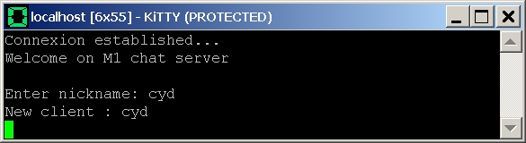

<iframe src="gad.html" frameborder="0" scrolling="no" style="border: 1px solid gray; padding: 0; overflow:hidden; scrolling: no; top:0; left: 0; width: 100%;" onload="this.style.height=(this.contentWindow.document.body.scrollHeight+5)+'px';"></iframe>

## Protection against unfortunate keyboard input

With **KiTTY** you can protect your session against unfortunate keyboard input. A **Protect** option is available in the main menu. 
By selecting it the terminal window is protected aginst all input. 
This option can also be activated by pressing **CTRL+F9** key combination.

When a window is in protected mode, its title changes. 

 
