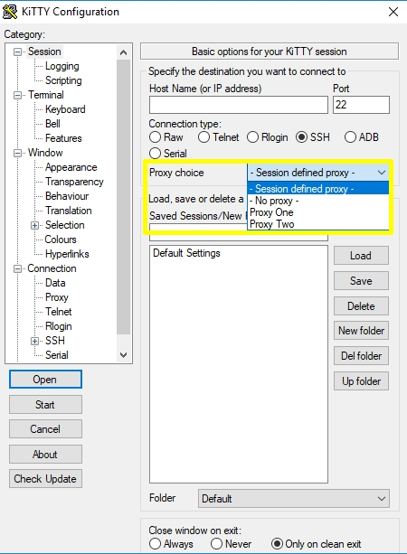

<div style="text-align: center;"><iframe src="gad.html" frameborder="0" scrolling="no" style="border: 1px solid gray; padding: 0; overflow:hidden; scrolling: no; top:0; left: 0; width: 100%;" onload="this.style.height=(this.contentWindow.document.body.scrollHeight+5)+'px';"></iframe></div>

## Proxy choice

When working with bastion server, it could be boring to always ssh this one then to jump to reach the host we really want to connect to.  

A solution could be to open a permanent connection to the bastion with a **dynamic port forward** that acts like a **proxy socks**. Then configure your sessions to connect to real destination host throught this proxy (in `Connection/Proxy` panel of the configuration box).  

In order to make easier the connections, there is now an option for selecting a proxy to use directly from the main window of the configuration box:



The **proxy choice** feature is disabled by default. The option can be activated by adding these two lines to the **kitty.ini** file.

***kitty.ini file***

    [ConfigBox]
    proxyselection=yes


Proxies definitions are located in a new **KiTTY** configuration key: `[HKEY_CURRENT_USER\Software\9bis.com\KiTTY\Proxies]`.

Below, is a configuration file to create a new proxy définition (**Proxy One [7070]**), that point to a socks4 server started on localhost (**127.0.0.1**) and listening on port **7070** (`00001b9e` in hexa):

```
Windows Registry Editor Version 5.00

[HKEY_CURRENT_USER\Software\9bis.com\KiTTY\Proxies\PROXY%20One%20[7070]]
"ProxyExcludeList"=""
"ProxyDNS"=dword:00000001
"ProxyLocalhost"=dword:00000000
"ProxyMethod"=dword:00000001
"ProxyHost"="127.0.0.1"
"ProxyPort"=dword:00001b9e
"ProxyUsername"=""
"ProxyPassword"=""
"ProxyTelnetCommand"="connect %host %port\\n"
"ProxyLogToTerm"=dword:00000001
```
