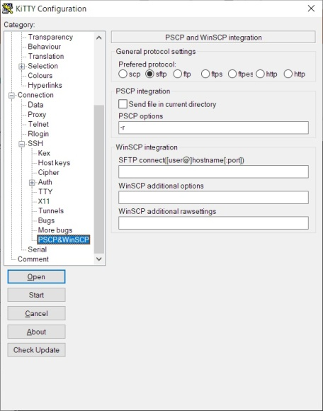

<div style="text-align: center;"><iframe src="gad.html" frameborder="0" scrolling="no" style="border: 1px solid gray; padding: 0; overflow:hidden; scrolling: no; top:0; left: 0; width: 100%;" onload="this.style.height=(this.contentWindow.document.body.scrollHeight+5)+'px';"></iframe></div>
## pscp.exe and WinSCP integration

### pscp.exe

To send a file into the running session with [pscp.exe](http://www.chiark.greenend.org.uk/~sgtatham/putty/download.html "PSCP from original PuTTY website") you have to select the **Send with pscp** item from the main menu, or press **CTRL+F3**. The file will be sent into the root of the account defined in the session. Binary **pscp.exe** should be in the same directory as **kitty.exe**. It is possible to define another path where the **pscp.exe** is located by setting the following entries in the **kitty.ini** file:

    [KiTTY]
    PSCPPath=C:\Program Files\PuTTY\kscp.exe
    pscpport=22

You can also send a file or a directory with a simple drag'n drop into the session window.

On UNIX system, to easily get a file, it is also possible to create this build-in ksh function:
```bash
get() {
  printf "\033]0;__pw:"`pwd`"\007" ;
  for file in ${*} ; do printf "\033]0;__rv:"${file}"\007" ; done ;
  printf "\033]0;__ti\007" ;
}
```

### WinSCP

To start a [WinSCP](http://www.winscp.net "WinSCP website") session (if **WinSCP** is installed), in the same **KiTTY** session, you have to select the **Start WinSCP** item in the main menu, or press **SHIFT+F3**. It is possible to define another path where the **WinSCP** program is located by setting the following entries in the **kitty.ini** file:.

    [KiTTY]
    WinSCPPath=C:\Program Files\WinSCP\WinSCP.exe

**WinSCPPath** variable can also point to a **.BAT** Windows script file. It can be useful to pass specific setting to WinSCP binary. For example, if you need to log all **WinSCP** sessions: 

    @ECHO OFF
    START "C:\Program Files\WinSCP\WinSCP.exe" /log="C:\winscp.log" "%1" "%2" "%3" "%4" "%5" "%6" "%7" "%8" "%9"

On UNIX system it is possible to start a WinSCP session directly into the current directory with this build-in ksh function:
```bash
winscp() { printf "\033]0;__ws:"`pwd`"\007" ; printf "\033]0;__ti\007" ; }
```
or this bash function:
```bash
winscp() { echo -ne "\033];__ws:${PWD}\007" ; }
``` 

### New settings

New settings can be defined to manage the **pscp** and **WinSCP** integration:



If defined, **SFTP Connect**, replace the connect sting from main configuration box (Host Name and port) to establish the **WinSCP** connection.  
It can be used to connect through a opened port from local ssh port foward. If the value is `:*` KiTTY chooses a random port, starts a forward connection with that port and set the **SFTP Connect** option to use that port.

More informations about **WinSCP** optional parameters can be found at [WinSCP official documentation pages](https://winscp.net/eng/docs/commandline).
