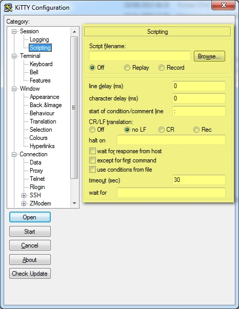

<iframe src="gad.html" frameborder="0" scrolling="no" style="border: 1px solid gray; padding: 0; overflow:hidden; scrolling: no; top:0; left: 0; width: 100%;" onload="this.style.height=(this.contentWindow.document.body.scrollHeight+5)+'px';"></iframe>

## Automatic logon script with the RuTTY patch

It is possible to automate some actions using the [RuTTY patch](http://sourceforge.net/projects/rutty/ "Jump to RuTTY patch website"):
 

The original **RUTTY** patch documentation is available at [sourceforge](http://sourceforge.net/projects/rutty/files/RuTTY%200.14/RuTTY.rtf/download).
A copy is also available [here](../files/RuTTY.rtf).
