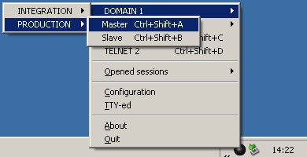

<div style="text-align: center;"><iframe src="gad.html" frameborder="0" scrolling="no" style="border: 1px solid gray; padding: 0; overflow:hidden; scrolling: no; top:0; left: 0; width: 100%;" onload="this.style.height=(this.contentWindow.document.body.scrollHeight+5)+'px';"></iframe></div>
## The session launcher

In order to replace in **Pageant** the function that allows you to launch a saved session, but without any menu or sub-menu, a launcher was integrated into **KiTTY**. To start this launcher just run KiTTY from the command line with the `-launcher` parameter:
```
kitty.exe -launcher
```

The software will start in the system tray as a new icon like this: 


Sessions are organized into menus and sub-menus, corresponding to the [folders](SessionsFilter.md). The sub-menu separator is the backslash character **\**.



The menu tree is saved in registry key `[HKEY_CURRENT_USER\Software\9bis.com\KiTTY\Launcher]`. By default, this key is reloaded from the saved sessions each time the **Launcher** starts. However you can choose to organize the menu yourself by modifying the registry key. To do that you must disable the automatic reload by adding these two lines in your **kitty.ini** file:
```
[Launcher]
reload=no
```
 
An **Opened sessions** menu is available to hide/unhide some running sessions. The sessions will completely disappear from the desktop and the task bar. This is useful when there are too many sessions running at the same time.
 
