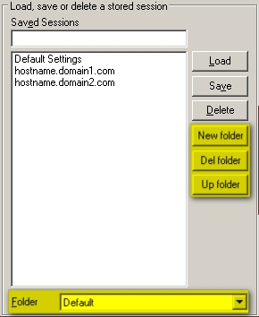

<div style="text-align: center;"><iframe src="gad.html" frameborder="0" scrolling="no" style="border: 1px solid gray; padding: 0; overflow:hidden; scrolling: no; top:0; left: 0; width: 100%;" onload="this.style.height=(this.contentWindow.document.body.scrollHeight+5)+'px';"></iframe></div>
## Sessions filter

### Folders
If you need to manage a large number of sessions, with KiTTY you can organize them into folders. One folder for each type of application, one folder per machine, one folder per environment ... or any other organisation. 
In the main configuration box you will find a new dropdown box. By selecting a specific folder you can reduce the number of sessions displayed in the selection list above.
 


For more information about folders management, consult the [manual](../doc/kitty-folders_list_feature.pdf "Kitty folder list feature").

### Pattern
It is also possible to filter on session name or session hostname by writing characters into **Saved Session/New Folder** field.

This feature can be turned on/off by adding these lines in your **%APPDATA%/KiTTY/Kitty.ini** configuration file.

```
[ConfigBox]
; filter: enable/disable filter in saved sessions selection box
filter=yes
```

All filter can be cleared by pressing the `Clear`button.
