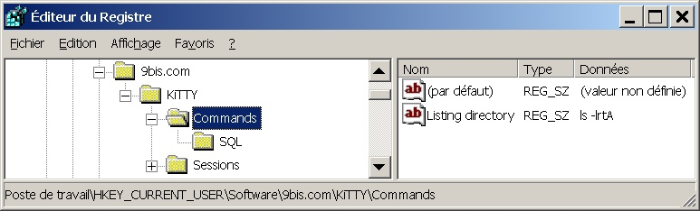
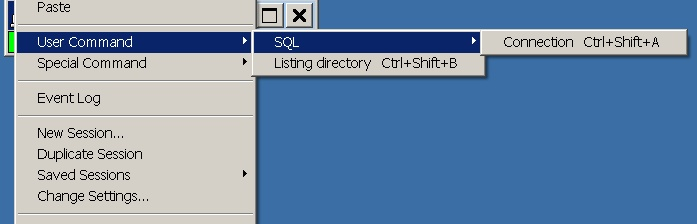

<div style="text-align: center;"><iframe src="gad.html" frameborder="0" scrolling="no" style="border: 1px solid gray; padding: 0; overflow:hidden; scrolling: no; top:0; left: 0; width: 100%;" onload="this.style.height=(this.contentWindow.document.body.scrollHeight+5)+'px';"></iframe></div>
## Shortcuts for pre-defined command

A new registry key `[HKEY_CURRENT_USER\Software\9bis.com\KiTTY\Commands]` was created in the KiTTY binary tree of the Windows registry.



It is designed to define a new menu: **User command**.




To create this new menu, download and run this [example file](../files/kitty_usrcmd.reg). To reach this new menu press on CTRL and click on the right mouse button from any place within a KiTTY window. Then select menu "User Command".

In the menu you can add as many commands as you want. Shortcuts (Ctrl+Shift+A ...), only available in regitry mode, are set up in the order of creation.

You can disable the shortcuts option, if it interferes with other software (for example if you run **Midnight Commander** in a KiTTY window). You just have to add these two lines in the **kitty.ini** file:
```
[KiTTY]
shortcuts=no
```
----

From KiTTY 0.60.56 two new shortcuts levels were added to the global level described above. It is possible to create

* Shortcuts for each saved session by creating the registry key `[HKEY_CURRENT_USER\Software\9bis.com\KiTTY\Sessions\''SessionName''\Commands]` where ''SessionName'' is the name of the affected session
* Shortcuts for each [Sessions filter](pages/SessionsFilter.md) by creating the registry key  `[HKEY_CURRENT_USER\Software\9bis.com\KiTTY\Folders\''FolderName''\Commands]`
