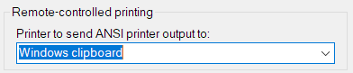

<div style="text-align: center;"><iframe src="gad.html" frameborder="0" scrolling="no" style="border: 1px solid gray; padding: 0; overflow:hidden; scrolling: no; top:0; left: 0; width: 100%;" onload="this.style.height=(this.contentWindow.document.body.scrollHeight+5)+'px';"></iframe></div>
## Standard output to clipboard

With **KiTTY**, it is possible to send standard output directly to Windows Clipboard.

First, it is necessary to configure a *fake* printer into **Terminal** panel of the configuration box:  



Then start the session and create this build-in shell function:

```bash
# Function to send standard output to Windows clipboard
function wcl {
  echo -ne '\e''[5i'
  cat $*
  echo -ne '\e''[4i'
  echo "Copied to Windows clipboard" 1>&2
}
```

And use is with pipe:

```bash
$ ls -lart | wcl
Copied to Windows clipboard
```
