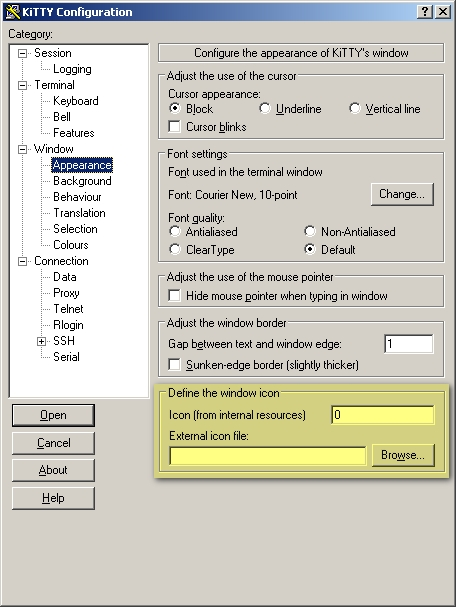

<iframe src="gad.html" frameborder="0" scrolling="no" style="border: 1px solid gray; padding: 0; overflow:hidden; scrolling: no; top:0; left: 0; width: 100%;" onload="this.style.height=(this.contentWindow.document.body.scrollHeight+5)+'px';"></iframe>

## That's all folks!

In order to easily identify a specific window among a large number of open windows, you can set a specific icon for each of them. As you can see, these icons represent famous cartoon heroes. That's why this version of KiTTY software is called **That's all folks!**. The icon is chosen randomly by the software. Then to change the icon associated with the window, you have to press the CTRL key and click on the left mouse button in the middle of the screen.

By default the icon feature is disabled. To enable it you need to add these two lines to the **kitty.ini** configuration file:

    [KiTTY]
    icon=yes

It is also possible to set permanently the icon of a session. In the main configuration box there is a new input zone. You just have to set the icon number you want to link to the session.

Follow [this link](kitty_icon.md) to get the number corresponding to each icon.

And you can also choose an **External icon file**. 
 
----
 
 
                                          

