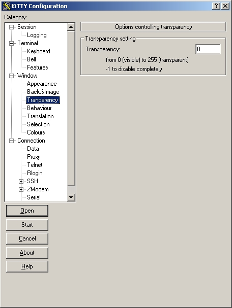

<iframe src="gad.html" frameborder="0" scrolling="no" style="border: 1px solid gray; padding: 0; overflow:hidden; scrolling: no; top:0; left: 0; width: 100%;" onload="this.style.height=(this.contentWindow.document.body.scrollHeight+5)+'px';"></iframe>

## Transparency

With **KiTTY** you can modify the transparency of the window. Use these keys to modify it:

* **CTRL +** (or **CTRL+UP**) on the numeric keypad to decrease transparency
* **CTRL -** (or **CTRL+DOWN**) on the numeric keypad to increase transparency

The transparency is disabled by default. The option can be activated by adding these two lines to the **kitty.ini** file.

***kitty.ini file***

    [KiTTY]
    transparency=yes

The transparency can be defined specifically for each session.

> Last minute information for [WinTabber](http://www.wintabber.com), [MTPuTTY](http://www.ttyplus.com/) and [Gadwin](http://www.gadwin.com/printscreen/) users: This software does not work with KiTTY when transparency management is on. For normal use, you must not activate it.
 
