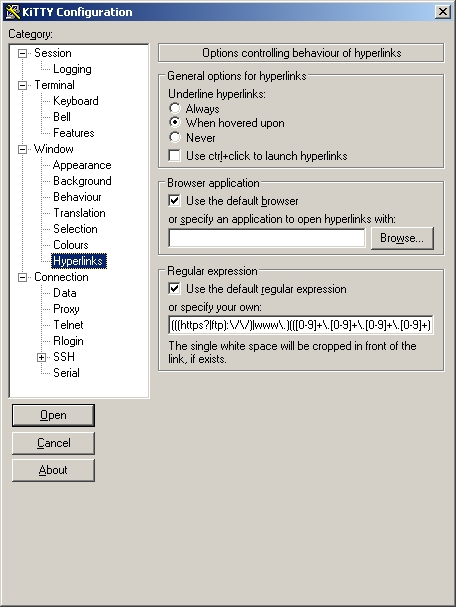

<div style="text-align: center;"><iframe src="gad.html" frameborder="0" scrolling="no" style="border: 1px solid gray; padding: 0; overflow:hidden; scrolling: no; top:0; left: 0; width: 100%;" onload="this.style.height=(this.contentWindow.document.body.scrollHeight+5)+'px';"></iframe></div>
## URL hyperlinks

You can specify a specific management for URL hyperlinks into your terminal:



To enable it add the two lines to your **%APPDATA%/KiTTY/kitty.ini** file:
```
[KiTTY]
hyperlink=yes
```
