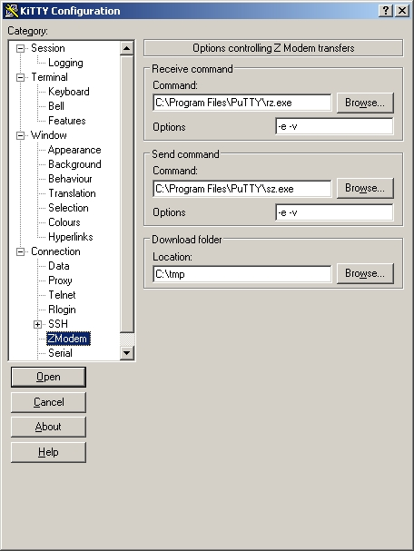

<iframe src="gad.html" frameborder="0" scrolling="no" style="border: 1px solid gray; padding: 0; overflow:hidden; scrolling: no; top:0; left: 0; width: 100%;" onload="this.style.height=(this.contentWindow.document.body.scrollHeight+5)+'px';"></iframe>

## ZModem

The **ZModem** patch from [LePuTTY](http://leputty.sourceforge.net/ "LePuTTY") is now integrated to **KiTTY**.

> This feature is broken from **[0.71](0.71.md)** version.

To activate it you need to add these two lines to your **%APPDATA%/KiTTY/kitty.ini** file:

    [KiTTY]
    zmodem=yes

**sz.exe** and **rz.exe** binaries are available [here](../files/kitty_zmodem.zip "ZModem tools").

The last KiTTY version that support **ZModem** feature is **[0.70.0.10](https://www.fosshub.com/KiTTY-old.html?dwl=kitty-0.70.0.10.exe)**.
 
