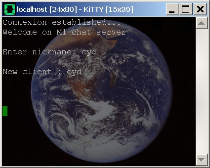

<iframe src="gad.html" frameborder="0" scrolling="no" style="border: 1px solid gray; padding: 0; overflow:hidden; scrolling: no; top:0; left: 0; width: 100%;" onload="this.style.height=(this.contentWindow.document.body.scrollHeight+5)+'px';"></iframe>

## Background image

If you want to add a background image in your sessions windows, you can do it with the [covidimus patch](https://web.archive.org/web/20050308132334/http://www.covidimus.net/projects/putty/putty.php) that was integrated into **KiTTY**.

> This feature is broken from **0.71** version.

By default this patch is disabled. To activate it it is necessary to add these two lines into the **%APPDATA%/KiTTY/kitty.ini** configuration file:

    [KiTTY]
    backgroundimage=yes

**KiTTY** accepts **BMP** and **JPEG** images.

----

> Caution: this patch is not compatible with non-ASCII characters managment (chinese, japanese ...).
 
